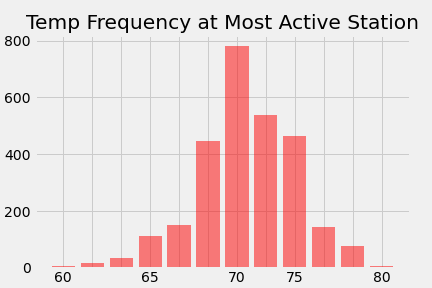
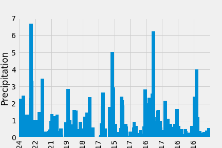

## Summary:

This project uses a SQL database and SqlAlchemy to import data from Hawaii weather stations, vizualize it, and display it online via flask ap. 

## The Files:
```
|+-- app.py -> Flask app to display findings on webpage
|+--climate_analysis.ipynb -> Imports data and generates tables, analysis, and vizualizations of weather data
|+--Resources
|  |   +--hawaii.sqlite ->Weather data
|   |+--images
|      +--temps_at_most_active_station.png -> Bar chart of temperatures over time at the most active station
|      +--vaca_temps -> frequency of different temperatures at most active station
```

## A Few Vizualization Samples:

 
 


